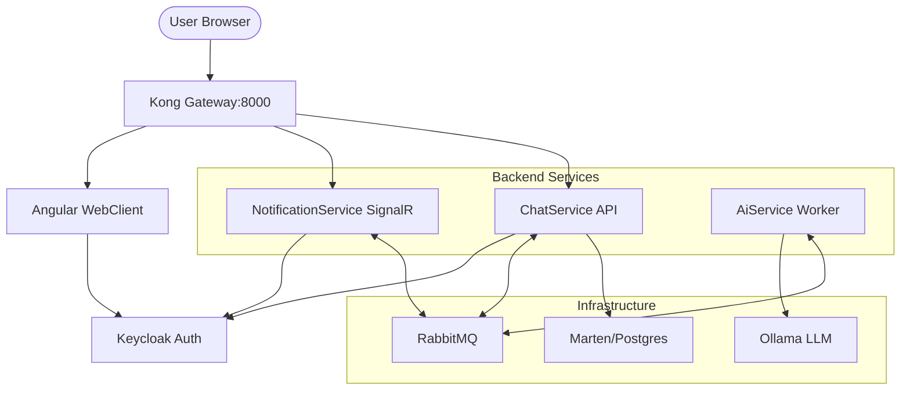

# AiChatPlatform

AiChatPlatform is a modern, scalable, event-driven ecosystem for real-time AI-assisted chat. It leverages **Event Sourcing**, **CQRS**, and **Sagas** to deliver a responsive, decoupled architecture.

## 🚀 Technologies Used
*   **Backend**: .NET 10 Web API & Worker services
*   **Frontend**: Angular (v19+) with Material Design
*   **Messaging**: [Wolverine](https://wolverine.netlify.app/) (RabbitMQ provider)
*   **Database**: PostgreSQL 15 with [Marten](https://martendb.io/) (Event Store & Projections)
*   **Real-time Notifications**: ASP.NET Core SignalR
*   **Authentication**: [Keycloak](https://www.keycloak.org/) (OAuth2 / OIDC)
*   **AI Engine**: [Ollama](https://ollama.com/) (Llama3) & OpenAI compatibility
*   **API Gateway**: [Kong](https://docs.konghq.com/)

---

## 🏗️ Architecture Overview



## 📂 Project Structure

1.  **`ChatService`**: Core domain logic, event sourcing, and session management.
2.  **`AiService`**: Decoupled worker that interacts with LLMs (Ollama/OpenAI) and streams tokens.
3.  **`NotificationService`**: SignalR hub that bridges the event bus to the client for real-time streaming.
4.  **`WebClient`**: Modern Angular SPA providing a premium chat interface.
5.  **`BuildingBlocks`**: Shared contracts and core infrastructure abstractions.
6.  **`Kong`**: Declarative configuration for the API Gateway.

---

## 🧠 End-to-End Flow

1.  **User Message**: Sent via `WebClient` to `ChatService` (saved as `MessageCreatedEvent`).
2.  **Saga Orchestration**: `ConversationSaga` triggers `LlmResponseRequestedEvent`.
3.  **Real-time Generation**: `AiService` streams tokens via RabbitMQ.
4.  **Instant Delivery**: `NotificationService` pushes tokens to the browser via SignalR.
5.  **Persistence**: Once complete, the saga saves the full AI response message.

---

## 🏃 Getting Started

### Prerequisites
*   [.NET 10 SDK](https://dotnet.microsoft.com/)
*   [Docker Desktop](https://www.docker.com/products/docker-desktop/)

### Quick Start (Docker)
```bash
docker-compose up --build -d
```
All services are accessible via the **Kong Gateway** at `http://localhost:8000`:
*   **Web Application**: `http://localhost:8000/`
*   **API Documentation (Scalar)**: `http://localhost:8000/scalar`
*   **SignalR Hub**: `http://localhost:8000/hubs/chat`
*   **Auth (Keycloak)**: `http://localhost:8080`

### Authentication
*   **Test User**: `testuser`
*   **Password**: `password`

---

## 🛠️ Design Principles
*   **Event-Driven**: Complete decoupling via RabbitMQ.
*   **High Performance**: Minimal latency using SignalR streaming and Marten inline projections.
*   **Premium UX**: Elegant material design with "ChatGPT-like" typing effects.